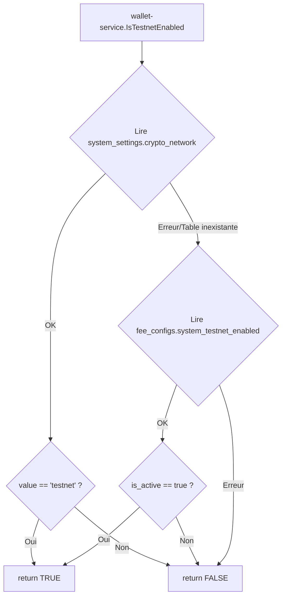

# Exchange Service - Configuration Système

## Vue d'Ensemble

Ce document décrit les tables de configuration système partagées gérées par l'`exchange-service`.

## Tables de Configuration

### `system_settings`

Table partagée contenant les paramètres globaux du système.

| Clé | Type | Valeur par Défaut | Description |
|-----|------|-------------------|-------------|
| `crypto_network` | string | `mainnet` | Réseau crypto (`mainnet` / `testnet`) |
| `rate_update_interval` | integer | `60` | Intervalle MAJ taux (secondes) |
| `binance_test_mode` | boolean | `true` | Mode test Binance |
| `rate_update_enabled` | boolean | `true` | MAJ auto des taux |

> [!IMPORTANT]
> La clé `crypto_network` contrôle le réseau utilisé pour **tous** les wallets crypto :
> - `mainnet` → Adresses BTC `bc1...`, ETH mainnet, etc.
> - `testnet` → Adresses BTC `tb1...`, Sepolia, Shasta, etc.

### `fee_configs`

Table des frais et configurations système.

| Clé | Type | is_active | Description |
|-----|------|-----------|-------------|
| `system_testnet_enabled` | system_toggle | **false** | Active les réseaux testnet |
| `system_maintenance_mode` | system_toggle | false | Mode maintenance |
| `system_signup_enabled` | system_toggle | true | Inscriptions utilisateurs |
| `exchange_crypto_to_fiat` | percentage | true | Frais conversion crypto→fiat |

## Flux de Lecture du Mode Testnet



## Ordre de Démarrage Important

> [!WARNING]
> L'`exchange-service` doit être démarré **AVANT** le `wallet-service` pour que les tables soient initialisées correctement.

### docker-compose.yml

```yaml
wallet-service:
  depends_on:
    - exchange-service  # Assure l'ordre de démarrage
```

## Fichiers Clés

| Fichier | Rôle |
|---------|------|
| [`internal/repository/settings_repository.go`](file:///c:/Users/D/Desktop/ai/microservices-financial-app/services/exchange-service/internal/repository/settings_repository.go) | Gestion table `system_settings` |
| [`internal/repository/fee_repository.go`](file:///c:/Users/D/Desktop/ai/microservices-financial-app/services/exchange-service/internal/repository/fee_repository.go) | Gestion table `fee_configs` |

## Configuration via Admin Dashboard

Le panneau d'administration permet de modifier ces paramètres en temps réel :

1. **Settings** → **Crypto** → Toggle "Réseaux de Test (Testnet)"
2. Les changements sont persistés dans `system_settings` avec `crypto_network = 'testnet'` ou `'mainnet'`

## Seed par Défaut

Lors du premier démarrage (après `docker-compose down -v`), les valeurs par défaut sont :

- `crypto_network` = `mainnet` (wallets BTC génèrent `bc1...`)
- `system_testnet_enabled` = `false`
