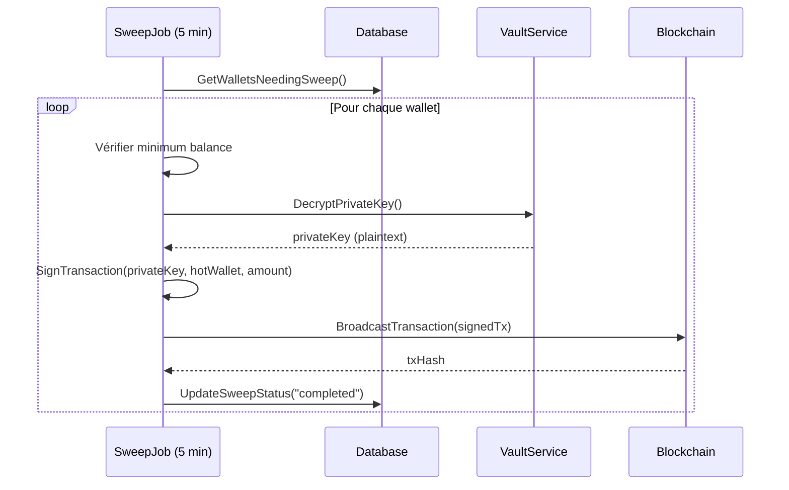

# Architecture Hybride des Dépôts Crypto

## Vue d'Ensemble

Le système utilise une approche hybride optimisée pour les dépôts crypto :

| Type | Mécanisme | Blockchain TX | Avantage |
|------|-----------|---------------|----------|
| **Adresse Unique** | BTC, ETH, SOL... | Sweep vers Hot Wallet | Sécurité maximale |
| **Memo/Tag** | XRP, XLM, TON | Direct sur Hot Wallet | Aucun frais de sweep |
| **Interne** | Utilisateur → Utilisateur | Aucune TX | Instantané, gratuit |

## Diagramme d'Architecture

```
╔═══════════════════════════════════════════════════════════════════════════════╗
║                          FLUX DE DÉPÔT CRYPTO                                 ║
╠═══════════════════════════════════════════════════════════════════════════════╣
║                                                                               ║
║  ┌─────────────────────────────────────────────────────────────────────────┐  ║
║  │                    DÉPÔT EXTERNE (Adresse Unique)                       │  ║
║  │                    BTC, ETH, SOL, TRX, USDT, USDC, BNB, DOGE, LTC       │  ║
║  ├─────────────────────────────────────────────────────────────────────────┤  ║
║  │                                                                         │  ║
║  │  1. User demande adresse de dépôt                                       │  ║
║  │     └── crypto_service.GenerateWallet() → adresse unique par user       │  ║
║  │                                                                         │  ║
║  │  2. Fonds arrivent sur l'adresse du user (blockchain)                   │  ║
║  │     └── Webhook Tatum/Blockdaemon détecte transaction                   │  ║
║  │                                                                         │  ║
║  │  3. Crédit DB immédiat (Balance user +X)                                │  ║
║  │     └── wallet_service.ProcessCryptoDeposit()                           │  ║
║  │     └── walletRepo.MarkForSweep(walletID, amount)                       │  ║
║  │                                                                         │  ║
║  │  4. SweepService (toutes les 5 min)                                     │  ║
║  │     └── Récupère wallets avec pending_sweep_amount > minimum            │  ║
║  │     └── Décrypte la clé privée depuis le Vault                          │  ║
║  │     └── Signe et broadcast TX vers Hot Wallet                           │  ║
║  │     └── Met à jour sweep_status = "completed"                           │  ║
║  │                                                                         │  ║
║  └─────────────────────────────────────────────────────────────────────────┘  ║
║                                                                               ║
║  ┌─────────────────────────────────────────────────────────────────────────┐  ║
║  │                    DÉPÔT DIRECT AVEC MEMO                               │  ║
║  │                    XRP, XLM, TON                                         │  ║
║  ├─────────────────────────────────────────────────────────────────────────┤  ║
║  │                                                                         │  ║
║  │  1. User demande adresse de dépôt                                       │  ║
║  │     └── Retourne: Adresse Hot Wallet + deposit_memo unique              │  ║
║  │                                                                         │  ║
║  │  2. Fonds arrivent DIRECTEMENT sur le Hot Wallet (avec memo)            │  ║
║  │     └── Webhook lit le memo → identifie le user                         │  ║
║  │                                                                         │  ║
║  │  3. Crédit DB immédiat                                                  │  ║
║  │     └── walletRepo.GetByDepositMemo(memo) → wallet                      │  ║
║  │     └── Balance user +X                                                 │  ║
║  │                                                                         │  ║
║  │  ⭐ PAS DE SWEEP NÉCESSAIRE - Déjà sur le Hot Wallet !                   │  ║
║  │                                                                         │  ║
║  └─────────────────────────────────────────────────────────────────────────┘  ║
║                                                                               ║
║  ┌─────────────────────────────────────────────────────────────────────────┐  ║
║  │                    TRANSFERT INTERNE (DB ONLY)                          │  ║
║  │                    User A → User B (tous les deux sur la plateforme)    │  ║
║  ├─────────────────────────────────────────────────────────────────────────┤  ║
║  │                                                                         │  ║
║  │  1. User A envoie crypto vers adresse xyz...                            │  ║
║  │     └── wallet_service.SendCrypto() vérifie si adresse = interne        │  ║
║  │                                                                         │  ║
║  │  2. Si interne:                                                         │  ║
║  │     └── Debit User A (DB)                                               │  ║
║  │     └── Credit User B (DB)                                              │  ║
║  │     └── AUCUNE TRANSACTION BLOCKCHAIN                                   │  ║
║  │                                                                         │  ║
║  │  ⭐ Instantané, frais 0, pas de gas !                                    │  ║
║  │                                                                         │  ║
║  └─────────────────────────────────────────────────────────────────────────┘  ║
╚═══════════════════════════════════════════════════════════════════════════════╝
```

## 1. Sweep Service

Le `SweepService` consolide automatiquement les fonds des wallets utilisateurs vers le Hot Wallet de la plateforme.

### Configuration par Défaut

```go
// Seuils minimaux pour sweep (économiser les frais)
MinBalances: map[string]float64{
    "BTC":  0.0001, // ~$5 à $50k BTC
    "ETH":  0.001,  // ~$3 à $3k ETH
    "USDT": 10.0,   // $10 minimum
    "SOL":  0.1,    // ~$15 à $150 SOL
    // ...
}
```

### Étapes du Sweep



### Fichiers Clés

| Fichier | Fonction |
|---------|----------|
| [sweep_service.go](file:///c:/Users/D/Desktop/ai/microservices-financial-app/services/wallet-service/internal/services/sweep_service.go) | Job de sweep automatique |
| [wallet_repository.go](file:///c:/Users/D/Desktop/ai/microservices-financial-app/services/wallet-service/internal/repository/wallet_repository.go) | `GetWalletsNeedingSweep()`, `UpdateSweepStatus()` |

## 2. Dépôts avec Memo (XRP, XLM, TON)

Certaines blockchains supportent les "destination tags" ou "memos", permettant d'utiliser une seule adresse pour tous les utilisateurs.

### Comment ça marche

```
┌──────────────────────────────────────────────────────────────┐
│  DÉPÔT TRADITIONNEL (BTC, ETH)                               │
├──────────────────────────────────────────────────────────────┤
│  User A → Adresse A (unique)                                 │
│  User B → Adresse B (unique)                                 │
│  User C → Adresse C (unique)                                 │
│  ───────────────────────                                     │
│  ⚠️ 3 adresses = 3 sweep TX nécessaires                       │
└──────────────────────────────────────────────────────────────┘

┌──────────────────────────────────────────────────────────────┐
│  DÉPÔT AVEC MEMO (XRP, XLM, TON)                             │
├──────────────────────────────────────────────────────────────┤
│  User A → Hot Wallet + Memo: USR_A_12345                     │
│  User B → Hot Wallet + Memo: USR_B_67890                     │
│  User C → Hot Wallet + Memo: USR_C_11111                     │
│  ───────────────────────                                     │
│  ✅ 1 adresse = 0 sweep TX nécessaires !                      │
└──────────────────────────────────────────────────────────────┘
```

### Champs du Wallet

```go
type Wallet struct {
    // Champs pour le système hybride
    DepositMemo        *string    // Unique pour XRP/XLM/TON
    SweepStatus        string     // none, pending, completed
    LastSweptAt        *time.Time // Dernier sweep
    PendingSweepAmount float64    // Montant en attente
}
```

### Fonction RequiresMemo

```go
// crypto_service.go
func (s *CryptoService) RequiresMemo(currency string) bool {
    switch strings.ToUpper(currency) {
    case "XRP", "XLM", "TON":
        return true
    default:
        return false
    }
}
```

## 3. Transferts Internes

Quand un utilisateur envoie des crypto à un autre utilisateur de la plateforme, aucune transaction blockchain n'est créée.

### Détection Automatique

```go
// wallet_service.go - SendCrypto()

// Vérifier si l'adresse destination appartient à un user plateforme
destinationWallet, _ := s.walletRepo.GetByAddress(req.ToAddress)
isInternalTransfer := destinationWallet != nil

if isInternalTransfer {
    // ✅ Transfert DB uniquement
    return s.processInternalCryptoTransfer(wallet, destinationWallet, req)
}

// ❌ Transfert externe via Hot Wallet
return s.processExternalCryptoTransfer(wallet, userID, req)
```

### Avantages

| Aspect | Externe | Interne |
|--------|---------|---------|
| **Frais blockchain** | ~$1-50 selon réseau | $0 |
| **Délai** | 1-60 min (confirmations) | Instantané |
| **Frais plateforme** | % + blockchain | % uniquement |

## 4. Wallets Plateforme (Hot/Cold) - Architecture Complète

La plateforme maintient ses propres wallets crypto pour gérer les opérations.

### Types de Wallets Plateforme

| Type | Fonction | Accès Clé Privée | Seuils |
|------|----------|------------------|--------|
| **🔥 Hot Wallet** | Opérations quotidiennes | Chiffré, accessible via API | MinBalance: garde liquidité |
| **❄️ Cold Wallet** | Stockage long terme | Hors ligne / Multi-sig | MaxBalance: sécurité |

### Modèle de Données

```go
type PlatformCryptoWallet struct {
    ID             string    // UUID unique
    Currency       string    // BTC, ETH, SOL...
    Network        string    // mainnet, testnet
    WalletType     string    // "hot" ou "cold"
    Address        string    // Adresse blockchain
    EncryptedKey   string    // Clé privée chiffrée (Hot uniquement)
    Label          string    // "BTC Hot Wallet Principal"
    Balance        float64   // Solde comptable (DB)
    MinBalance     float64   // Seuil de réapprovisionnement
    MaxBalance     float64   // Seuil de consolidation vers Cold
    Priority       int       // Ordre de sélection (1 = premier choisi)
    IsActive       bool      // Wallet actif/désactivé
}
```

---

## 5. Flux Complet: Fonds Externes → Plateforme

### 5.1. Dépôt Externe avec Adresse Unique (BTC, ETH, SOL...)

```
╔══════════════════════════════════════════════════════════════════════════════╗
║                  FLUX: DÉPÔT EXTERNE → HOT WALLET                            ║
╠══════════════════════════════════════════════════════════════════════════════╣
║                                                                              ║
║  [1] CRÉATION WALLET USER                                                    ║
║  ══════════════════════                                                      ║
║                                                                              ║
║      User → "Je veux déposer du BTC"                                         ║
║                    ↓                                                         ║
║      crypto_service.GenerateWallet(userID, "BTC")                            ║
║                    ↓                                                         ║
║      Génère: { address: "bc1q...", private_key: "5KJv..." }                  ║
║                    ↓                                                         ║
║      vault.EncryptPrivateKey(private_key) → AES-256-GCM                      ║
║                    ↓                                                         ║
║      DB: wallets table                                                       ║
║      ┌─────────────────────────────────────────────────────────┐             ║
║      │ user_id: "user-123"                                     │             ║
║      │ currency: "BTC"                                         │             ║
║      │ wallet_address: "bc1qxyz..."                            │             ║
║      │ private_key_encrypted: "eyJhbGci..." (Base64)           │             ║
║      │ balance: 0.0                                            │             ║
║      │ sweep_status: "none"                                    │             ║
║      │ pending_sweep_amount: 0.0                               │             ║
║      └─────────────────────────────────────────────────────────┘             ║
║                                                                              ║
╠══════════════════════════════════════════════════════════════════════════════╣
║                                                                              ║
║  [2] RÉCEPTION DES FONDS (BLOCKCHAIN)                                        ║
║  ═════════════════════════════════════                                       ║
║                                                                              ║
║      Expéditeur externe (exchange, autre wallet)                             ║
║                    ↓                                                         ║
║      Transaction blockchain: 0.5 BTC → bc1qxyz... (adresse user)             ║
║                    ↓                                                         ║
║      Webhook Tatum/Blockdaemon détecte la TX confirmée                       ║
║                    ↓                                                         ║
║      wallet_handler.HandleDepositWebhook(txData)                             ║
║                    ↓                                                         ║
║      walletRepo.GetByAddress("bc1qxyz...") → trouve le wallet user           ║
║                                                                              ║
╠══════════════════════════════════════════════════════════════════════════════╣
║                                                                              ║
║  [3] CRÉDIT IMMÉDIAT (DB-ONLY)                                               ║
║  ═════════════════════════════                                               ║
║                                                                              ║
║      wallet_service.ProcessCryptoDeposit(walletID, 0.5)                      ║
║                    ↓                                                         ║
║      DB Update:                                                              ║
║      ┌─────────────────────────────────────────────────────────┐             ║
║      │ UPDATE wallets SET                                      │             ║
║      │   balance = balance + 0.5,          -- User peut trader │             ║
║      │   pending_sweep_amount = 0.5,       -- À consolider     │             ║
║      │   sweep_status = 'pending'          -- Marque pour job  │             ║
║      │ WHERE id = 'wallet-abc'                                 │             ║
║      └─────────────────────────────────────────────────────────┘             ║
║                                                                              ║
║      ⭐ L'UTILISATEUR PEUT MAINTENANT UTILISER SES 0.5 BTC                    ║
║         (Échanges, transferts internes) AVANT le sweep!                      ║
║                                                                              ║
╠══════════════════════════════════════════════════════════════════════════════╣
║                                                                              ║
║  [4] SWEEP AUTOMATIQUE (TOUTES LES 5 MIN)                                    ║
║  ═════════════════════════════════════════                                   ║
║                                                                              ║
║      SweepService.RunSweepJob()                                              ║
║                    ↓                                                         ║
║      walletRepo.GetWalletsNeedingSweep()                                     ║
║      → Retourne tous les wallets avec pending_sweep_amount >= seuil          ║
║                    ↓                                                         ║
║      Pour chaque wallet à sweeper:                                           ║
║                                                                              ║
║        1. Decrypt private key                                                ║
║           vault.DecryptPrivateKey(encrypted_key) → "5KJv..."                 ║
║                                                                              ║
║        2. Get Platform Hot Wallet                                            ║
║           platformService.SelectBestCryptoWalletForCredit("BTC", "mainnet")  ║
║           → Retourne le Hot Wallet avec la plus haute priorité               ║
║              qui n'a pas atteint son max_balance                             ║
║                                                                              ║
║        3. Estimate Fees                                                      ║
║           cryptoService.EstimateTransactionFee("BTC", 0.5) → 0.00005 BTC     ║
║                                                                              ║
║        4. Create & Sign Transaction                                          ║
║           cryptoService.SignTransaction(privateKey, {                        ║
║               from: "bc1qxyz..." (user address),                             ║
║               to: "bc1platform..." (hot wallet),                             ║
║               amount: 0.49995 BTC (moins les frais)                          ║
║           })                                                                 ║
║                                                                              ║
║        5. Broadcast                                                          ║
║           blockchain.BroadcastTransaction("BTC", signedTxHex)                ║
║           → txHash: "abc123..."                                              ║
║                                                                              ║
║        6. Update DB                                                          ║
║           ┌─────────────────────────────────────────────────────┐            ║
║           │ -- User wallet                                      │            ║
║           │ UPDATE wallets SET                                  │            ║
║           │   pending_sweep_amount = 0,                         │            ║
║           │   sweep_status = 'completed',                       │            ║
║           │   last_swept_at = NOW()                             │            ║
║           │ WHERE id = 'wallet-abc'                             │            ║
║           │                                                     │            ║
║           │ -- Platform Hot Wallet                              │            ║
║           │ UPDATE platform_crypto_wallets SET                  │            ║
║           │   balance = balance + 0.49995                       │            ║
║           │ WHERE id = 'hot-wallet-btc-1'                       │            ║
║           │                                                     │            ║
║           │ -- Transaction Ledger                               │            ║
║           │ INSERT INTO platform_transactions (                 │            ║
║           │   debit_account_id: 'wallet-abc',                   │            ║
║           │   credit_account_id: 'hot-wallet-btc-1',            │            ║
║           │   amount: 0.49995,                                  │            ║
║           │   operation_type: 'sweep',                          │            ║
║           │   tx_hash: 'abc123...'                              │            ║
║           │ )                                                   │            ║
║           └─────────────────────────────────────────────────────┘            ║
║                                                                              ║
╚══════════════════════════════════════════════════════════════════════════════╝
```

### 5.2. Dépôt avec Memo (XRP, XLM, TON) - Pas de Sweep Nécessaire

```
╔══════════════════════════════════════════════════════════════════════════════╗
║                  FLUX: DÉPÔT MEMO → DIRECT HOT WALLET                        ║
╠══════════════════════════════════════════════════════════════════════════════╣
║                                                                              ║
║  [1] CRÉATION "WALLET" USER (Sans clé privée!)                               ║
║  ═════════════════════════════════════════════                               ║
║                                                                              ║
║      User → "Je veux déposer du XRP"                                         ║
║                    ↓                                                         ║
║      crypto_service.RequiresMemo("XRP") → true                               ║
║                    ↓                                                         ║
║      Hot Wallet XRP de la plateforme: rPlatformHotWallet...                  ║
║                    ↓                                                         ║
║      Génère memo unique: crypto_service.GenerateDepositMemo()                ║
║      → "USR_abc123_1706000000"                                               ║
║                    ↓                                                         ║
║      DB: wallets table                                                       ║
║      ┌─────────────────────────────────────────────────────────┐             ║
║      │ user_id: "user-123"                                     │             ║
║      │ currency: "XRP"                                         │             ║
║      │ wallet_address: "rPlatformHotWallet..." (SHARED!)       │             ║
║      │ deposit_memo: "USR_abc123_1706000000" (UNIQUE!)         │             ║
║      │ private_key_encrypted: NULL (pas de clé user)           │             ║
║      │ balance: 0.0                                            │             ║
║      │ sweep_status: "not_applicable"                          │             ║
║      └─────────────────────────────────────────────────────────┘             ║
║                                                                              ║
║  ⭐ RETOUR À L'UTILISATEUR:                                                   ║
║     "Envoyez vos XRP à: rPlatformHotWallet..."                               ║
║     "IMPORTANT: Utilisez le memo: USR_abc123_1706000000"                     ║
║                                                                              ║
╠══════════════════════════════════════════════════════════════════════════════╣
║                                                                              ║
║  [2] RÉCEPTION (DIRECT SUR HOT WALLET!)                                      ║
║  ══════════════════════════════════════                                      ║
║                                                                              ║
║      Expéditeur → rPlatformHotWallet + memo "USR_abc123_1706000000"          ║
║                    ↓                                                         ║
║      Webhook détecte TX vers le Hot Wallet                                   ║
║                    ↓                                                         ║
║      wallet_handler.HandleDepositWebhook(txData)                             ║
║      {                                                                       ║
║          to: "rPlatformHotWallet...",                                        ║
║          amount: 500,                                                        ║
║          memo: "USR_abc123_1706000000"  ← Identifiant clé!                   ║
║      }                                                                       ║
║                    ↓                                                         ║
║      walletRepo.GetByDepositMemo("USR_abc123_1706000000")                    ║
║      → Trouve le wallet de user-123                                          ║
║                                                                              ║
╠══════════════════════════════════════════════════════════════════════════════╣
║                                                                              ║
║  [3] CRÉDIT (DB-ONLY, AUCUN SWEEP!)                                          ║
║  ══════════════════════════════════                                          ║
║                                                                              ║
║      DB Update:                                                              ║
║      ┌─────────────────────────────────────────────────────────┐             ║
║      │ UPDATE wallets SET                                      │             ║
║      │   balance = balance + 500                               │             ║
║      │ WHERE deposit_memo = 'USR_abc123_1706000000'            │             ║
║      │                                                         │             ║
║      │ -- Platform Hot Wallet déjà a les fonds!                │             ║
║      │ UPDATE platform_crypto_wallets SET                      │             ║
║      │   balance = balance + 500                               │             ║
║      │ WHERE address = 'rPlatformHotWallet...'                 │             ║
║      └─────────────────────────────────────────────────────────┘             ║
║                                                                              ║
║  ⭐ AUCUNE TRANSACTION BLOCKCHAIN SUPPLÉMENTAIRE!                             ║
║     → Économie de frais réseau                                               ║
║     → Crédit instantané                                                      ║
║                                                                              ║
╚══════════════════════════════════════════════════════════════════════════════╝
```

---

## 6. Consolidation Hot → Cold (Sécurité)

Quand le Hot Wallet atteint un seuil de sécurité, les fonds sont transférés vers le Cold Wallet.

```
┌─────────────────────────────────────────────────────────────────┐
│                    RÈGLE DE CONSOLIDATION                       │
├─────────────────────────────────────────────────────────────────┤
│                                                                 │
│   Si Hot Wallet balance > max_balance:                          │
│      → Transférer (balance - target_balance) vers Cold          │
│                                                                 │
│   Exemple:                                                      │
│   - Hot Wallet BTC: max_balance = 5 BTC, target = 2 BTC         │
│   - Balance actuelle: 7 BTC                                     │
│   - Consolidation: 7 - 2 = 5 BTC → Cold Wallet                  │
│                                                                 │
└─────────────────────────────────────────────────────────────────┘
```

### Code de Consolidation

```go
// platform_account_service.go
func (s *PlatformAccountService) ConsolidateUserFunds(req *ConsolidateUserFundsRequest) error {
    // 1. Sélection intelligente du wallet cible
    targetWallet, _ := s.repo.SelectCryptoWalletForCredit(
        req.Currency, 
        req.Network, 
        req.Amount,
    )
    
    // 2. Credit DB
    s.repo.CreditCryptoWallet(targetWallet.ID, req.Amount)
    
    // 3. Record ledger entry
    tx := &models.PlatformTransaction{
        CreditAccountID:   targetWallet.ID,
        DebitAccountID:    req.UserWalletID,
        OperationType:     models.OpTypeConsolidation,
        // ...
    }
    s.repo.CreateTransaction(tx)
}
```

---

## 7. Sélection Intelligente des Wallets

Le système utilise une sélection intelligente basée sur priorité et capacité.

### Pour Crédit (Recevoir des fonds)

```go
// Critères de sélection:
// 1. is_active = true
// 2. currency = demandé
// 3. balance + amount <= max_balance (capacité)
// 4. ORDER BY priority ASC (1 = première priorité)
// 5. LIMIT 1

func SelectCryptoWalletForCredit(currency, network string, amount float64) {
    SELECT * FROM platform_crypto_wallets
    WHERE currency = $1 
      AND network = $2
      AND is_active = true
      AND (max_balance = 0 OR balance + $3 <= max_balance)
    ORDER BY priority ASC
    LIMIT 1
}
```

### Pour Débit (Envoyer des fonds)

```go
// Critères de sélection:
// 1. is_active = true
// 2. currency = demandé
// 3. balance >= amount (suffisamment de fonds)
// 4. balance - amount >= min_balance (garde le minimum)
// 5. ORDER BY priority ASC, balance DESC (priorité puis plus gros solde)

func SelectCryptoWalletForDebit(currency, network string, amount float64) {
    SELECT * FROM platform_crypto_wallets
    WHERE currency = $1 
      AND network = $2
      AND is_active = true
      AND balance >= $3
      AND (min_balance = 0 OR balance - $3 >= min_balance)
    ORDER BY priority ASC, balance DESC
    LIMIT 1
}
```

---

## 8. Transaction Ledger (Double Entry)

Toutes les opérations sont enregistrées en double entrée.

| Champ | Description |
|-------|-------------|
| `debit_account_id` | Compte débité (source) |
| `credit_account_id` | Compte crédité (destination) |
| `amount` | Montant |
| `operation_type` | sweep, consolidation, exchange, fee, admin_credit |
| `reference_type` | Type de référence (tx_hash, exchange_id) |
| `reference_id` | ID de la référence |
| `performed_by` | Admin ID (si opération manuelle) |

### Types d'Opérations

| Type | Débit | Crédit | Description |
|------|-------|--------|-------------|
| `sweep` | User Wallet | Hot Wallet | Consolidation automatique |
| `consolidation` | Hot Wallet | Cold Wallet | Transfert sécurité |
| `exchange` | User (fiat) | Platform Reserve | Achat crypto |
| `fee` | User | Fee Account | Frais plateforme |
| `withdrawal` | Hot Wallet | External | Retrait user |
| `admin_credit` | External | Account | Injection admin |

---

## Résumé des Fichiers

| Fichier | Responsabilité |
|---------|----------------|
| [sweep_service.go](file:///c:/Users/D/Desktop/ai/microservices-financial-app/services/wallet-service/internal/services/sweep_service.go) | Job de sweep automatique |
| [platform_account_service.go](file:///c:/Users/D/Desktop/ai/microservices-financial-app/services/wallet-service/internal/services/platform_account_service.go) | Gestion Hot/Cold, sélection intelligente, consolidation |
| [wallet_service.go](file:///c:/Users/D/Desktop/ai/microservices-financial-app/services/wallet-service/internal/services/wallet_service.go) | Orchestration dépôts/envois users |
| [crypto_service.go](file:///c:/Users/D/Desktop/ai/microservices-financial-app/services/wallet-service/internal/services/crypto_service.go) | Génération wallets, signature TX, memo |
| [wallet.go](file:///c:/Users/D/Desktop/ai/microservices-financial-app/services/wallet-service/internal/models/wallet.go) | Modèle Wallet avec champs sweep/memo |
| [platform_models.go](file:///c:/Users/D/Desktop/ai/microservices-financial-app/services/wallet-service/internal/models/platform_models.go) | Modèles PlatformCryptoWallet, PlatformTransaction |
