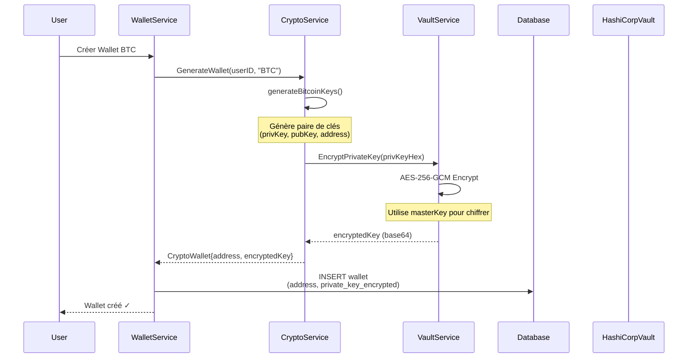

# Wallet Service - Architecture de Sécurité des Clés Privées

## Vue d'Ensemble

Ce document décrit la stratégie de chiffrement des clés privées des wallets crypto dans le `wallet-service`.

## Flux de Création d'un Wallet Crypto



## Stratégie de Chiffrement

### 1. Clé Maître (Master Key)

La clé maître est une clé AES-256 (32 bytes) utilisée pour chiffrer/déchiffrer toutes les clés privées. Elle est récupérée selon cet ordre de priorité :

| Priorité | Source | Variable | Description |
|----------|--------|----------|-------------|
| 1 | Env Variable | `WALLET_MASTER_KEY` | Clé hex de 64 caractères (256 bits) |
| 2 | HashiCorp Vault | `secret/wallet-service/wallet_master_key` | Récupérée via API Vault |
| 3 | PBKDF2 | `WALLET_SECRET` + `WALLET_SALT` | Dérivation sécurisée (100,000 itérations) |
| 4 | Random (DEV) | Auto-générée | ⚠️ **DÉVELOPPEMENT UNIQUEMENT** - Perdues au redémarrage |

### 2. Algorithme de Chiffrement

```
┌─────────────────────────────────────────────────────────────┐
│                    AES-256-GCM                              │
├─────────────────────────────────────────────────────────────┤
│  • Mode: Galois/Counter Mode (GCM)                          │
│  • Taille clé: 256 bits                                     │
│  • Nonce: 12 bytes (généré aléatoirement par crypto/rand)   │
│  • Authentication Tag: Intégré (AEAD)                       │
│  • Sortie: Base64(nonce + ciphertext + tag)                 │
└─────────────────────────────────────────────────────────────┘
```

> [!IMPORTANT]
> **AES-GCM** fournit à la fois le **chiffrement** ET **l'authentification**. Toute modification des données chiffrées sera détectée lors du déchiffrement.

### 3. Flux de Chiffrement

```go
// 1. Récupérer la clé maître (singleton)
vault := security.GetVaultService()

// 2. Chiffrer la clé privée
// - Génère un nonce aléatoire de 12 bytes
// - Chiffre avec AES-256-GCM
// - Prépend le nonce au ciphertext
// - Encode en Base64
encryptedKey, err := vault.EncryptPrivateKey(privateKeyHex)

// 3. Stocker en base de données
wallet.PrivateKeyEncrypted = &encryptedKey
db.Create(wallet)
```

## Stockage en Base de Données

### Table `wallets`

| Colonne | Type | Description |
|---------|------|-------------|
| `id` | UUID | Identifiant unique |
| `user_id` | VARCHAR | Propriétaire du wallet |
| `wallet_address` | VARCHAR | Adresse publique (bc1..., 0x..., T...) |
| `private_key_encrypted` | TEXT | Clé privée chiffrée (Base64) |
| `currency` | VARCHAR | BTC, ETH, SOL, etc. |

> [!NOTE]
> La clé privée n'est **JAMAIS** stockée en clair. Seule la version chiffrée est persistée.

## Fichiers Clés

| Fichier | Rôle |
|---------|------|
| [`internal/security/vault.go`](file:///c:/Users/D/Desktop/ai/microservices-financial-app/services/wallet-service/internal/security/vault.go) | Service de chiffrement/déchiffrement (VaultService) |
| [`internal/services/crypto_service.go`](file:///c:/Users/D/Desktop/ai/microservices-financial-app/services/wallet-service/internal/services/crypto_service.go) | Génération de wallets et encapsulation du chiffrement |
| [`internal/services/wallet_service.go`](file:///c:/Users/D/Desktop/ai/microservices-financial-app/services/wallet-service/internal/services/wallet_service.go) | Orchestration création wallet + stockage DB |
| [`common/secrets/vault.go`](file:///c:/Users/D/Desktop/ai/microservices-financial-app/services/common/secrets/vault.go) | Client HashiCorp Vault (lecture/écriture secrets) |

## Configuration Production

### Variables d'Environnement Requises

```bash
# Option 1: Clé directe (recommandée pour Kubernetes secrets)
WALLET_MASTER_KEY=<64_hex_chars>  # Exemple: a1b2c3...64 caractères

# Option 2: Via HashiCorp Vault
VAULT_ADDR=http://vault:8200
VAULT_TOKEN=<vault_token>

# Option 3: Dérivation PBKDF2
WALLET_SECRET=<secret_passphrase>
WALLET_SALT=<salt_value>
```

### docker-compose.yml

```yaml
wallet-service:
  environment:
    - VAULT_ADDR=http://vault:8200
    - VAULT_TOKEN=${VAULT_TOKEN}
    # OU
    - WALLET_MASTER_KEY=${WALLET_MASTER_KEY}
```

## Sécurité - Bonnes Pratiques

> [!CAUTION]
> **NE JAMAIS** :
> - Logger les clés privées en clair
> - Exposer `WALLET_MASTER_KEY` dans les logs
> - Utiliser le mode développement (clé auto-générée) en production
> - Stocker la master key dans le code source

> [!TIP]
> **RECOMMANDATIONS** :
> - Utiliser HashiCorp Vault en production
> - Rotation régulière de la master key
> - Chiffrement du disque pour la base de données
> - Audit logs pour tous les accès aux clés

## Résumé

| Élément | Valeur |
|---------|--------|
| **Algorithme** | AES-256-GCM |
| **Clé de chiffrement** | Master Key 256 bits |
| **Source clé** | Vault / Env / PBKDF2 |
| **Stockage DB** | Base64(nonce + ciphertext) |
| **Protection intégrité** | GCM Authentication Tag |
